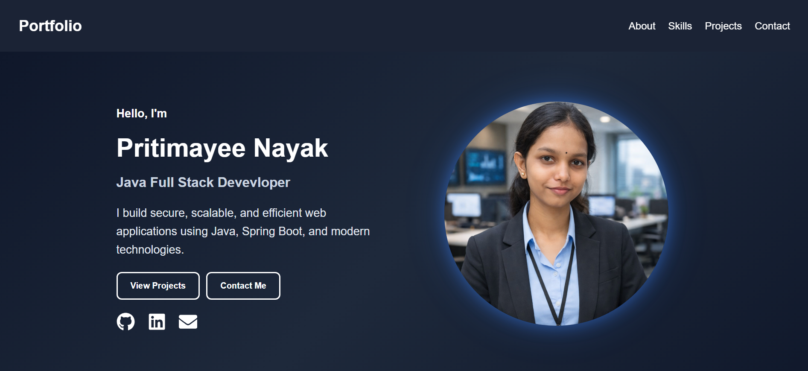

# 🌟 Pritimayee Nayak Portfolio

Welcome to my personal portfolio website! 🚀

This portfolio showcases my journey as a **Java Full-Stack Developer**, featuring my projects, technical skills, and passion for building secure, scalable, and user-friendly applications.

🔗 **Live Portfolio:** https://your-netlify-link.netlify.app

---

## 📸 Portfolio Preview



---

## ✨ Features

- 🏠 Responsive Home Page
- 👩‍💻 About Me Section
- 🛠️ Skills Showcase with Technology Icons
- 📂 Interactive Projects Section
- 📧 Functional Contact Form using EmailJS
- ⬆️ Scroll-to-Top Button
- 📱 Fully Responsive Design
- 🎨 Modern and Professional UI

---

## 🛠️ Tech Stack

### Frontend
- React
- TypeScript
- HTML5
- CSS3
- React Icons
- Vite

### Services
- EmailJS

### Version Control
- Git
- GitHub

---

## 🚀 Featured Projects

### 🛒 Slay with Style
E-commerce backend application with:
- User Authentication
- Shopping Cart Management
- Order Management
- Product Management

**Tech Stack:** Java, Spring Boot, Spring Security, MySQL

---

### ✅ Todo Application
Task management application with:
- User Authentication
- CRUD Operations
- Task Management

**Tech Stack:** Java, Spring Boot, Spring Security, MySQL

---

### 📈 Trading System
Stock trading platform with:
- User Authentication
- Buy & Sell Stocks
- Wallet Management

**Tech Stack:** Java, Spring Boot, Spring Security, MySQL

---

## ⚙️ Installation

Clone the repository:

```bash
git clone https://github.com/spriti04/My-Portfolio.git
```

Move into the project directory:

```bash
cd portfolio
```

Install dependencies:

```bash
npm install
```

Run the project:

```bash
npm run dev
```

Build for production:

```bash
npm run build
```

---

## 📧 Contact

📍 Odisha, India

📧 Email: pritimayeen3@gmail.com

💼 LinkedIn: [https://linkedin.com/in/your-linkedin-profile](https://www.linkedin.com/in/pritimayee-nayak-741b68371/)

🐙 GitHub: [https://github.com/your-github-username](https://github.com/spriti04/)

🌐 Portfolio: [https://your-netlify-link.netlify.app
](https://pritimayee-portfolio.netlify.app/)
---

## 🤝 Connect With Me

I am always open to:
- Full-Stack Development Opportunities
- Java Developer Roles
- Open Source Contributions
- Learning and Networking

Feel free to connect with me!

---

## 👩‍💻 Author

**Pritimayee Nayak**

Passionate Java Full-Stack Developer dedicated to building scalable and efficient applications while continuously learning new technologies.

> "Code. Learn. Build. Repeat." 🚀
